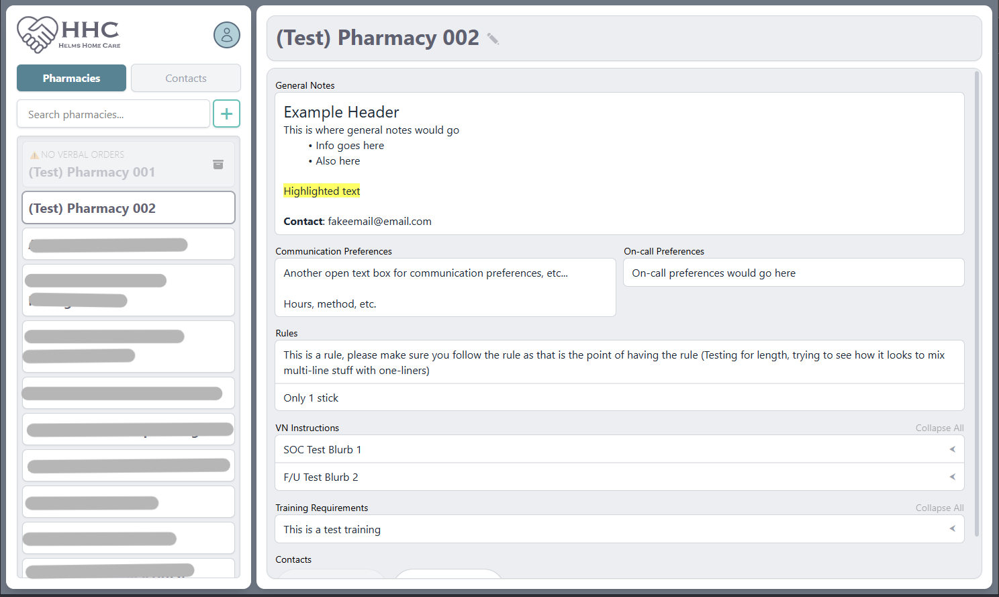
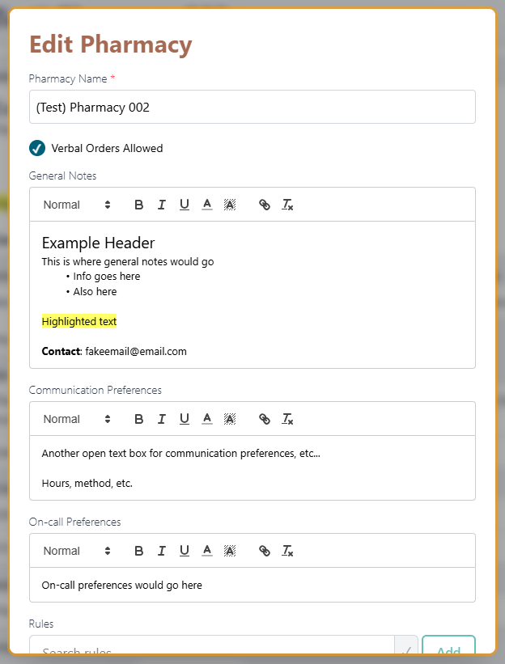
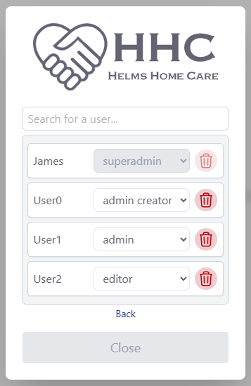
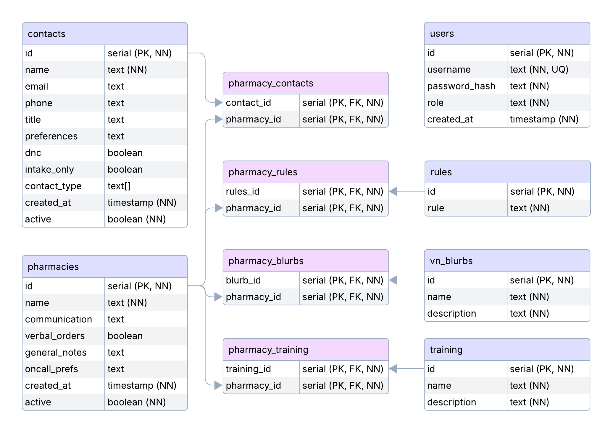

# Pharmacy Info | Helms Home Care 🏥

A responsive internal web application designed to streamline access to pharmacy and contact information. Built with **React**, **Node.js**, and **PostgreSQL**, the app features a minimalist UI paired with robust backend logic, authentication, and dynamic data relationships.

### Table of Contents
- [Tech Stack](#-tech-stack)
- [Key Features (Summary)](#-key-features)
  - [Detailed Breakdown ↗](docs#-feature-breakdown--pharmacy-info-app)
- [Screenshots](#%EF%B8%8F-screenshots)
  - [Additional Images ↗](docs/screenshots)
- [Project Structure](#%EF%B8%8F-project-structure)
- [Local Setup](#-local-setup)
- [Database Diagram](#-database-diagram)
- [Notes](#-notes)

---

## 🔧 Tech Stack

- **Frontend:** React + Vite + Tailwind CSS
- **Backend:** Node.js + Express
- **Database:** PostgreSQL (with pgAdmin 4)
- **Authentication:** JWTs with refresh token support + bcrypt
- **Deployment:** The production deployment runs on Windows Server, using NGINX to serve the built Vite frontend and reverse proxy API requests to the Node.js backend. The backend is managed with PM2, which ensures automatic restarts and state restoration on reboot via `pm2 resurrect`. Both NGINX and the backend are launched at system startup using PowerShell scripts registered in the Windows Startup folder.

---

## 💡 Key Features

- 🔐 **Role-Based Authentication**  
  JWT-secured login system with refresh tokens and dynamic access control.

- 🧠 **Smart Data Editing**  
  Modals for editing/viewing pharmacy and contact records with rich text formatting (Quill).

- 🔍 **Dynamic Filtering**  
  Real-time search and filter functionality for large datasets.

- 🧩 **Many-to-Many Relationships**  
  Pharmacies and contacts can be linked in both directions, with logic handling sync and display.

- 📱 **Mobile Responsive UI**  
  Designed with clean layouts and adaptive components.

- 🛠️ **Admin Tools**  
  Custom-built user management interface for assigning and removing roles.

- 🪵 **Built-In Audit Log Viewer**  
  Admins can access a dedicated panel to view detailed logs of user activity, including what was changed, when, and by whom.

- 💾 **Automated Database Backups to SharePoint**  
  PostgreSQL backups are automatically generated and uploaded to a secure SharePoint drive every Friday at 8AM.

Want a deeper technical look at how these features are implemented? \
📂 **More detailed descriptions of features available in the [`/docs`](./docs) folder.**

---

## 🖼️ Screenshots

### Main Interface


> *Searchable, collapsible pharmacy view with dynamic sections and scrollable containers.*

### Edit Modal


> *Full-featured modal for updating pharmacy data using Quill editors and structured inputs.*

### Admin View


> *Role management panel accessible only to admins, featuring role assignment and deletion.*

📂 **More UI previews available in the [`/docs/screenshots`](./docs/screenshots) folder.**

---

## 🗃️ Project Structure

```md
client/
└── src/
    ├── assets/
    ├── auth/
    ├── pages/
    │   ├── components/
    │   ├── content/
    │   └── modals/
    │       └── modal-content/
    │           └── user-content/
    └── config.js     ← add server IP + port

server/
├── controllers/
├── routes/
├── middleware/
├── db/
├── utils/
└── .env             ← set DB URL, PORT, JWT_SECRET, REFRESH_SECRET
```

---

## 🧪 Local Setup

**This project consists of two separate apps: the frontend (`client`) and the backend (`server`).** Each must be installed and run independently.

### 🔹 Client Setup (React frontend)

```bash
cd client
npm install
npm run dev
```
> Make sure to create `client/src/config.js`:
```js
export default {
    server_ip: 'XX',
    server_port: 'XX',
};
```

### 🔹 Server Setup (Node.js backend)

```bash
cd server
npm install
npm run start
```
> You'll also need a `.env` file in `server/`:
```env
# Server port
PORT=XX

# Database info
DB_USER=XX
DB_HOST=XX
DB_NAME=XX
DB_PASSWORD=XX
DB_PORT=XX

# SharePoint/M365 info (for backups)
CLIENT_ID=XX
CLIENT_SECRET=XX
TENANT_ID=XX
SITE_ID=XX
DRIVE_ID=XX

# Sever secrets
JWT_SECRET=XX
REFRESH_SECRET=XX
```

---

## 🧭 Database Diagram

<p align="center"><br></p>

📂 **Schema available in the [`/server/db`](./server/db/schema.sql) folder.**

---

## 📝 Notes

This app is deployed internally and used by staff members at Helms Home Care. Due to the sensitive nature of the data and its intranet-only deployment, a live demo is unavailable. However, the screenshots and repo reflect the structure, functionality, and scope of the tool.

---

## 👋 Author

**James Kent** [GitHub](https://github.com/Jamesrkiv) \
Software / IT Lead @ Helms Home Care
