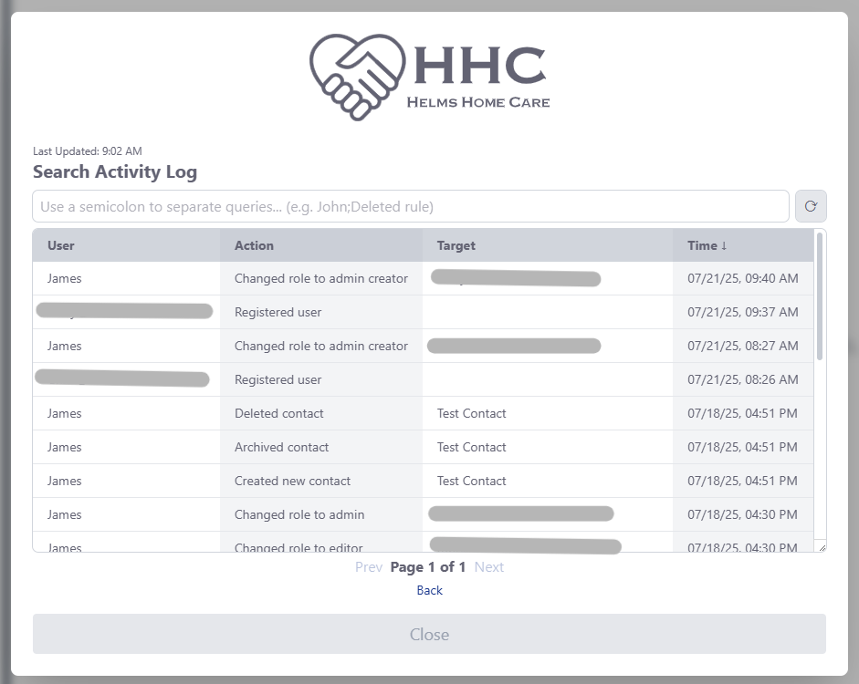
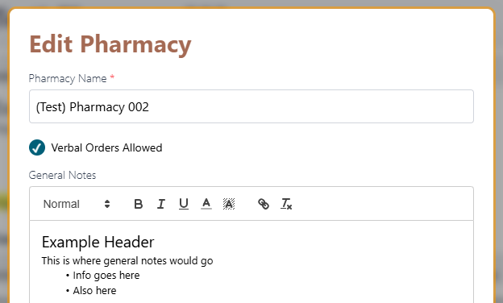
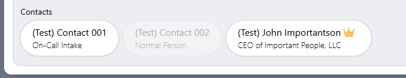
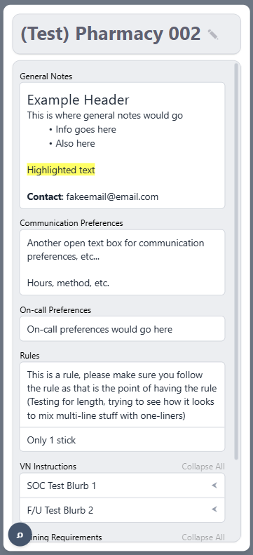

# 📚 Feature Breakdown — Pharmacy Info App

This document provides an in-depth look at the technical features of the Pharmacy Info web app, including how they were implemented and the rationale behind key decisions.

### Table of Contents
- [Authentication & Role-Based Access Control](#-authentication--role-based-access-control)
- [Audit Logging](#%EF%B8%8F-audit-logging)
- [Audit Log Viewer Tool](#-audit-log-viewer-tool)
- [Smart Data Editing](#-smart-data-editing-modals)
- [Real-Time Filtering & Search](#-real-time-filtering--search)
- [Many-to-Many Relationships](#-many-to-many-relationships)
- [Automated Backups to SharePoint](#-automated-backups-to-sharepoint)
- [Mobile-Responsive Design](#-mobile-responsive-design)
- [Planned Features & Considerations](#-planned-features--considerations)

---

## 🔐 Authentication & Role-Based Access Control

**Overview:**  
The app uses JWT-based authentication with support for refresh tokens to maintain secure, persistent sessions. Access to routes and features is determined by the user's assigned role (`user`, `editor`, `admin`, etc...).

**How it works:**

- **JWTs:** Upon successful login, users receive a short-lived access token and a long-lived refresh token. The access token is used for authenticated API requests.
- **Refresh Logic:** The frontend periodically uses the refresh token to request a fresh access token, avoiding forced logouts.
- **Middleware Protection:** Express middleware verifies tokens and checks user roles against the route’s required access level before continuing.
- **Frontend Visibility:** Components and pages are conditionally rendered based on the user’s role. For example:
  - The user management panel is only visible to users with the `admin` role or above.
  - Basic content editing is only accessible to the `editor` role or above, with specific content requiring higher roles.
- **User Management:** Admins can assign or remove roles via the in-app role management panel.
  - Privileged users can only assign roles to others, and only up to the role directly below them.
  - Self-assignment and assignment of roles to those with your same role or higher is not allowed.

---

## 🕵️ Audit Logging

**Overview:** 
All API routes that modify or add data to the database are tracked using **Winston**-based audit logging.

**What gets logged:**

- **User identity** (based on JWT-authenticated session)
- **Action type** (e.g. create, update, delete)
- **Target resource** (table + record ID)
- **Timestamp**

These logs provide traceability for any sensitive or critical changes and can be expanded in the future to include rollback support or exportable reports.

> This system ensures accountability without requiring changes to the database schema or interfering with core app functionality.

---

## 🪵 Audit Log Viewer Tool

**Overview:**  
This admin-only tool, integrated into the frontend, allows privileged users to view audit logs from within the application. This provides visibility into critical backend actions without requiring direct database access.

**Key Capabilities:**

- Displays logs with sortable columns for user, action type, target, and timestamp.
- Real-time filtering to locate entries quickly by user or action.
- Accessible only to users with the `admin` role (or higher, if expanded in the future).

> This UI addition complements the backend’s Winston-based logging, giving admins instant insight into who did what — and when — right from their browser.

---

## 🧠 Smart Data Editing (Modals)

**Overview:**  
Editing and creating pharmacy or contact records is handled through dynamic modals designed to match the project’s data model and role-based access structure. These modals enable seamless, user-friendly editing experiences while enforcing data consistency and permissions.

**Key Features:**

- **Structured Layouts:**  
  Each modal is customized based on the specific entity being edited. Fields are grouped by logical sections to keep data organized and easy to navigate.

- **Granular Role-Based Control:**  
  Individual sections or fields within the modal are conditionally rendered based on the user's role.

- **Rich Text Support with Quill:**  
  Certain fields utilize [Quill.js](https://quilljs.com/) for rich text editing, allowing users to format inputs clearly and consistently. This improves readability and reduces the likelihood of formatting issues.

- **Reusability via Shared Resources:**  
  Fields such as rules, training requirements, or associated contacts use a **shared data model** that allows:  
  - Adding items to a centralized list of reusable resources.  
  - Assigning existing items to multiple entities without re-entering data.  
  - Preventing data redundancy and improving maintainability.  
  
  These are backed by many-to-many relationships in the PostgreSQL database and synchronized dynamically in the UI.

**Example Use Case:**  
> When editing a pharmacy, an admin can select multiple training requirements from a predefined list. These requirements are stored once in the database and referenced by multiple pharmacies—allowing updates to cascade without duplicating records.

**Implementation Notes:**  
- Controlled inputs are used to manage form state and validation.  
- Changes are sent via API calls to the backend, where role and data validation are enforced again before updates are committed.  
- Modals are designed to remain responsive across screen sizes, ensuring mobile usability.

---

## 🔍 Real-Time Filtering & Search

**Overview:**  
Pharmacies and contacts serve as the two primary units of information within the app. To support efficient navigation and data management, real-time filtering is implemented across key pages and within editing modals—allowing users to quickly locate specific entries without needing to reload or re-query the database.

**Many-to-Many Context:**  
Contacts and pharmacies are connected via a many-to-many relationship. This is handled with a junction table in PostgreSQL that uses the `contact_id` and `pharmacy_id` as a composite primary key. This allows each entity to easily reference the other without duplicating data directly in the contact or pharmacy tables.

**How Filtering Works:**

- On page load, the relevant data (e.g. pharmacy list, contact list) is queried from the backend and stored in frontend state via `useState`.
- Simple filtering logic (e.g. `array.filter`) is applied in real-time as the user types into a search field.
- Data is periodically re-fetched from the backend to ensure that changes made by other users are reflected without requiring a full page refresh.

**Modal Filtering:**  
The modals for creating or editing entities also include filterable lists (such as linked contacts, rules, or training requirements). This ensures users can quickly associate relevant entities from potentially large datasets.

---

## 🧩 Many-to-Many Relationships

Several data entities in the app are connected to pharmacies via many-to-many relationships. These include:

- **Contacts**: A contact can be associated with multiple pharmacies, and each pharmacy may have multiple linked contacts.
- **Rules, Training Requirements, and VN Blurbs**: These are shared data models that can be linked to multiple pharmacies without duplication.

Each relationship is implemented using a dedicated **junction table** in PostgreSQL, using composite primary keys composed of the foreign keys from the related tables. This approach:

- Prevents redundant data storage
- Makes linking and unlinking efficient
- Enables scalable querying from either side of the relationship

These connections are surfaced throughout the UI—for example, in modals where users can search for and associate existing rules or contacts with a pharmacy. Changes to shared data propagate wherever the resource is linked, maintaining consistency without manual duplication.

---

## 💾 Automated Backups to SharePoint

**Overview:**  
To safeguard data and ensure disaster recovery readiness, the backend performs automated weekly PostgreSQL backups. These backups are timestamped and uploaded to a designated SharePoint drive via the Microsoft Graph API.

**How it works:**

- A scheduled Node.js cron job runs every Friday at 8AM.
- The job performs a PostgreSQL `pg_dump` using the custom format for better control during restoration.
- The resulting `.sql` file is uploaded to SharePoint using a secure OAuth2 workflow.
- Older backup files are automatically purged locally and remotely to conserve storage.

> Credentials for SharePoint access are stored in environment variables and scoped specifically for file upload purposes.

---

## 📱 Mobile-Responsive Design

**Overview:**  
The app is built to remain functional and user-friendly across a range of screen sizes. While the desktop layout favors side-by-side panels for viewing and searching, the mobile experience adapts to optimize usability on smaller screens.

**Responsive Behavior:**

- At smaller breakpoints, fields that are side-by-side on desktop automatically wrap into stacked layouts for better legibility.
- The dual-pane layout (searchable list + selected record view) collapses into a **toggleable panel system** on mobile. A floating button in the bottom-left allows the user to switch between views.
- Visibility and layout adjustments are handled using **Tailwind CSS** breakpoints, with only minimal custom logic required.

This approach allows the app to maintain full functionality on mobile devices without sacrificing usability or introducing duplicate UI components.

---

## 🧭 Planned Features & Considerations

- **Centralized Role-Permissions Panel:**  
  One potential upgrade would be a frontend permissions manager for defining access levels per role. This panel would ideally sync with the backend controllers to dynamically enforce permissions across the app.  
  > While the current system is functional and flexible for minor changes (thanks to utility functions and clean role-check logic), hardcoding access rules can become a bottleneck for larger-scale updates. Whether this overhaul is necessary depends on how frequently permissions are expected to change in production.

- **Additional Informational Fields:**  
  Future updates may include additional metadata on pharmacies, primarily fields that aren’t currently captured.

> These enhancements are under consideration and will be prioritized based on real-world usage patterns and user feedback post-deployment.
